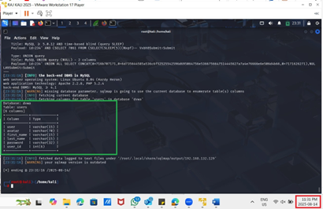
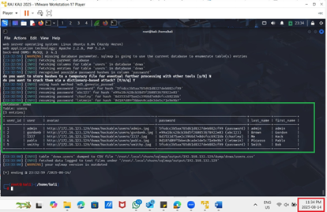
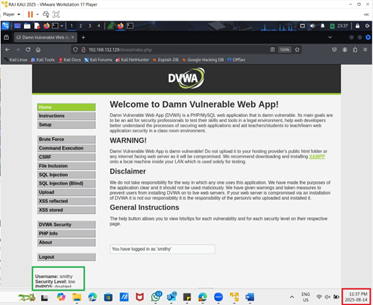
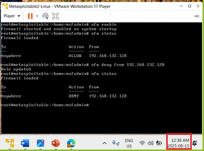

# 🔓 SQLMap Demonstration – SQL Injection & Defense

## 📌 Project Overview
This project demonstrates the use of **SQLMap** to exploit SQL injection vulnerabilities in a deliberately vulnerable application (**DVWA on Metasploitable2**) and the corresponding defense techniques using **Wireshark** and **UFW firewall**.  

The goal was to simulate a real-world penetration testing engagement in a **controlled lab environment**, highlighting both offensive and defensive cybersecurity practices.  

---

## ⚙️ Tools & Environment
- **Attacker:** Kali Linux (SQLMap v1.9.8-1, Firefox)  
- **Target:** DVWA on Metasploitable 2 (host-only network, no Internet access)  
- **Defense:**  
  - Wireshark (traffic monitoring & detection)  
  - UFW Firewall (blocking malicious IPs)  
- **Other:** Python, MySQL backend database  

---

## 🚀 Attack Demonstration (SQLMap)
1. **Captured Session Cookie** → logged into DVWA with default creds, extracted `PHPSESSID`.  
2. **Confirmed Injection** → SQLMap identified the `id` parameter as injectable.  
3. **Enumerated Databases/Tables** → retrieved schema and sensitive tables.  
4. **Dumped dvwa.users Table** → recovered usernames & password hashes.  
5. **Cracked Credentials** → simple passwords recovered (`admin:password`, etc.).  
6. **Proved Impact** → logged into DVWA as a stolen user (`smithy:password`).  

---

## 🛡️ Defense Demonstration
- **Wireshark Monitoring** → detected abnormal HTTP traffic patterns, multiple SQLMap requests, and spikes in GET activity.  
- **UFW Firewall Rules** → blocked attacker IP (`192.168.132.128`) at the OS level.  
- **Verification** → Wireshark confirmed repeated TCP retransmissions and dropped packets after the rule was applied.  

---

## ⚠️ Limitations of SQLMap
- Works **only for SQL Injection** (cannot detect XSS, CSRF, etc.).  
- Very **noisy** (high traffic volume makes it easy to detect).  
- Exploitation is **limited by DB user privileges** — cannot escalate beyond what the vulnerable account has access to.  

---

## 📈 Emerging Technology – AI-Powered WAF
AI-enhanced Web Application Firewalls (WAFs) use **machine learning and traffic behavior analysis** to detect and block automated tools like SQLMap in real time.  
- Vendors like **Akamai, Cloudflare, and Imperva** apply adaptive anomaly detection to stop SQLMap-style attacks.  
- SQLMap must rely on **tamper scripts and evasion** to bypass these defenses, showing the ongoing **cat-and-mouse arms race** in cybersecurity.  

---

## 📷 Screenshots
  
*Figure 1: SQLMap enumerating tables from DVWA*

  
*Figure 2: Dump of dvwa.users table including password hashes*

  
*Figure 3: Successful login using stolen credentials*

  
*Figure 4: Wireshark capture showing SQLMap traffic patterns*

  
*Figure 5: UFW firewall rule blocking attacker IP*  

---

## 📑 Full Report
The complete project documentation with detailed steps, commands, and analysis is available in the [Project Report](docs/SQLMap_Project_Report.pdf).  

---

## 🏆 Key Takeaways
- SQLMap is a powerful **ethical hacking tool** for simulating SQL injection attacks.  
- Effective defense requires **layered controls**: secure coding, monitoring (Wireshark), and access control (UFW).  
- Demonstrated the **dual perspective**: red team (attack) + blue team (defense).  
- Showcases practical skills in **penetration testing, detection, and mitigation**.  

---

## 📖 References
- SQLMap Developers. (2025). *sqlmapproject/sqlmap [GitHub repository].* GitHub. https://github.com/sqlmapproject/sqlmap  
- OWASP Foundation. (2021). *OWASP Top 10: 2021.* https://owasp.org/Top10/  
- Akamai. (2023). *Harnessing AI for Web Application Firewall.* https://www.akamai.com/blog/security/harnessing-artificial-intelligence-for-superior-web-application-firewall  
- Imperva. (2024). *Navigating AI traffic and scrapers.* https://www.imperva.com/blog/  
